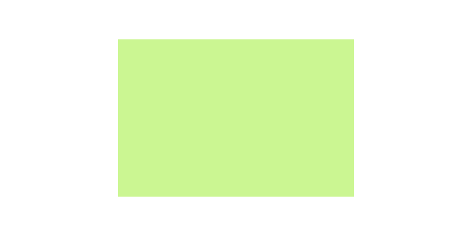
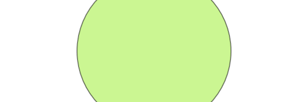

 <div align="center">
  
</div>

# Canvas V2
**Canvas V2** is a JavaScript library which Extend HTML Canvas to make the use of it more simple.
## Install
include this script in your HTML file.

```html
<script crossorigin src="https://cdn.jsdelivr.net/gh/omar-sedki/canvas-v2@main/dist/js/canvas-v2.js"></script>
```

## How to use
- You need to add HTML ```<canvas>``` element to your HTML. 
```html
 <canvas id="v2" width="600" height="300" style="border:1px solid #000000"></canvas>
```
```<canvas>``` is an HTML element which can be used to draw graphics via JavaScript.
The ```<canvas>``` element must have an ```id``` attribute so it can be referred to by JavaScript.
The ```width``` and ```height``` attribute is necessary to define the size of the canvas in pixels.

**Tip**: You can add a border to the canvas using a style attribute.


 - The canvas is blank. To draw on it, a script first needs to access the rendering context. 

```html
<script>
var canvas = document.getElementById("v2");
var ctx = canvas.getContext("2d");
</script> 
```

  Get the ```<canvas>``` element by calling the ```document.getElementById()``` method, then you can access the drawing context using its ```getContext()``` method. now you can draw on the canvas.
  
  
## Draw on the Canvas
draw Simple rectangle.
```javascript
ctx.fillStyle = "#cbf692";
ctx.fillRect(150, 50, 300, 200); 
```
The  ```fillStyle ``` property can be a CSS color, a gradient, or a pattern

The  ```fillRect(x,y,width,height) ```  method draws a rectangle, filled with the  ```fillStyle```

<p align="center">
  
</p>

## Full Code Example 
```html
<!DOCTYPE html>
<html lang="en">
	<head>
	</head>
	<body>
	 <canvas id="v2" width="600" height="300" style="border:1px solid #000000"></canvas>  
  <script crossorigin src="https://cdn.jsdelivr.net/gh/omar-sedki/canvas-v2@main/dist/js/canvas-v2.js"></script>
  <script>
    var canvas = document.getElementById("v2");
    var ctx = canvas.getContext("2d");
    ctx.fillStyle = "#cbf692";
    ctx.fillRect(150, 50, 300, 200); 
  </script> 
	</body>
</html>
```

## Shapes

### Triangle
 ```ctx.triangle( pointA, pointB, pointC )```
The ```triangle()``` method creates a triangle from 3 points . 
```pointA.x, pointA.y``` coordinate of first point, 
```pointB.x, pointB.y``` coordinate of second point, 
```pointC.x, pointC.y``` coordinate of third point.


ex : 
```javascript
ctx.triangle({x:90,y:50},{x:250,y:150},{x:150,y:250})
```

<p align="center">
  
</p>

### Square
 ```ctx.square(x, y, size)```
The ```square()``` method creates a square path whose starting point is at ```(x, y)``` and whose size is specified by ```size```. 

### Rectangle
 ```ctx.rect(x, y, width, height)```
The ```rect()``` method creates a rectangle path whose starting point is at ```(x, y)``` and whose size is specified by ```width, height```. 

### Circle
 ```ctx.circle(x, y, radius)```
The ```circle()``` method creates a circle path whose centered at ```(x, y)``` and whose radius is specified by ```radius```. 
ex : 
```javascript
ctx.circle("50%", "50%", "25%")
```

<p align="center">
  
</p>


### Polygon
```ctx.polygon(x, y, size, sides )```
The ```polygon()``` method creates a polygon path whose centered at ```(x, y)``` and  has sides specified by ```sides``` and size of sides is specified by ```size```.
